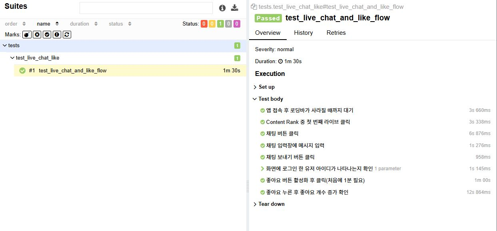

# 스푼라디오 E2E 테스트

[▶ 시연 영상 보기](assets/spoon_e2e.mp4)

이 테스트는 스푼라디오 앱에서 실사용자들이 가장 자주 사용하는 주요 기능인 아래 세 가지의 동작을 자동화로 검증합니다.
- 라이브 콘텐츠 진입
- 채팅 전송
- 좋아요 기능

<br>

---

### 테스트 흐름

| 단계 | 수행 내용 | 목적 |
|------|-----------|------|
| 1 | 앱 실행 및 로딩 완료 대기 | 테스트 시작 준비 |
| 2 | Top Lives 첫 번째 콘텐츠 진입 | 대표 콘텐츠 선택 및 진입 |
| 3 | 채팅 입력 및 전송 | 채팅 기능 정상 동작 검증 |
| 4 | 채팅 전송 내역 확인 | 메시지 전송 여부 확인 |
| 5 | 좋아요 버튼 활성화 대기 | 실시간 기능 대기 |
| 6 | 좋아요 클릭 | 인터랙션 동작 확인 |
| 7 | 좋아요 수 증가 확인 | 동작 검증|


### 주요 기술 스택
- Appium + Python
- Pytest
- Page Object Pattern
- Allure 리포트


### 실행 방법
1. Android 에뮬레이터 또는 실제 디바이스 실행
2. 아래 배치 파일 실행
    ```bash
    run_allure.bat
    ````

### 테스트 리포트 요약
테스트는 정상적으로 통과되었으며, 전체 흐름은 다음과 같이 검증되었습니다.



---

### 📁 폴더 구조

````
qa-automation-showcase/
└── 1_spoon_e2e/ # 스푼라디오 E2E 테스트
  ├── tests/ # 테스트 스크립트
  ├── pages/ # 유틸, Page Object 정의
  ├── conftest.py # Pytest 설정
  └── requirements.txt # 의존성 패키지
````