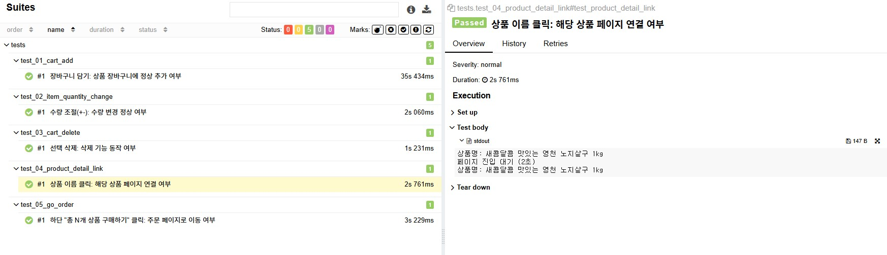

# 쿠팡 기능 테스트

[▶ 시연 영상 보기](https://youtu.be/1vD_2AatYK4)

[](https://youtu.be/1vD_2AatYK4)

이 테스트는 쿠팡의 장바구니 페이지 관련된 아래 기능을 자동화 테스트로 검증하였습니다.
- 장바구니 담기
- 수량 변경
- 상품 삭제
- 상품 페이지 이동
- 주문/결제 페이지 이동

---
<br>

### 테스트 대상 기능

| 대상 기능 | 검증 포인트 |
|---|---|
| 사전 준비 | 계정 로그인 상태 |
| 장바구니 담기 | 장바구니에 정상 추가 여부 |
| 수량 조절(+-) | 수량 변경 정상 여부 |
| 선택 삭제 | 삭제 기능 동작 여부 |
| 상품 이름 클릭 | 해당 상품 페이지 연결 여부 |
| 하단 "총 N개 상품 구매하기" 클릭 | 주문 페이지로 이동 여부 |

<br><br>

### 주요 기술 스택
- Appium + Python : Android 앱 자동화
- Pytest : 테스트 프레임워크
- Page Object Pattern : 유지보수를 고려한 테스트 구조
- Allure Report : 시각적 리포트 및 테스트 기록

<br><br>

### 실행 방법
1. 사전 준비
     - Android 에뮬레이터 실행
     - Appium 서버 실행
     - 쿠팡 APK 설치 (공식 앱스토어 또는 테스트용 APK 사용)
     - 테스트용 계정 로그인

2. 테스트 실행
     - 아래 배치 파일 실행
       ```bash
       # Windows 환경에서 실행
       run_allure.bat
       ```

<br><br>

### 테스트 리포트 요약
테스트는 정상적으로 통과되었으며, 전체 기능은 다음과 같이 검증되었습니다.



<br><br>

### 📁 폴더 구조
````
qa-automation-showcase/
└── 2_coupang_functional/ # 쿠팡 장바구니 기능 테스트
  ├── pages/ # 유틸, Page Object 정의
  ├── tests/ # 테스트 스크립트
  ├── conftest.py # Pytest 설정
  ├── requirements.txt # 의존성 패키지
  └── run_allure.bat # 실행 배치 파일

````
<br><br>
